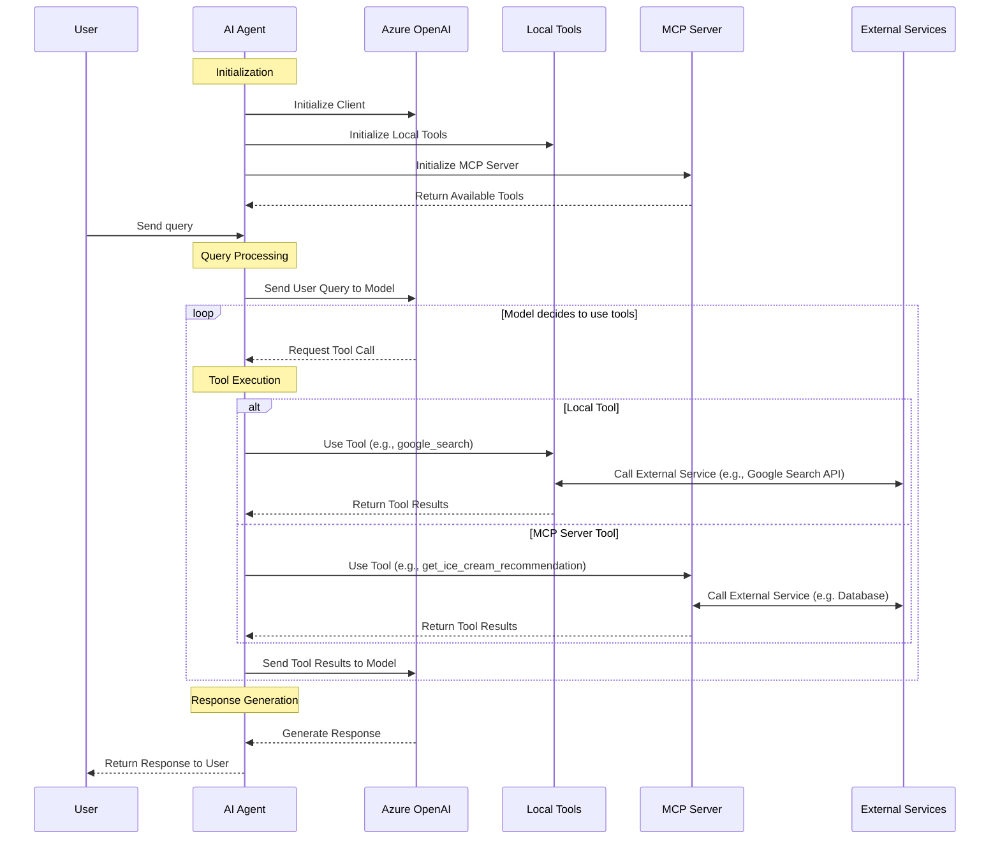
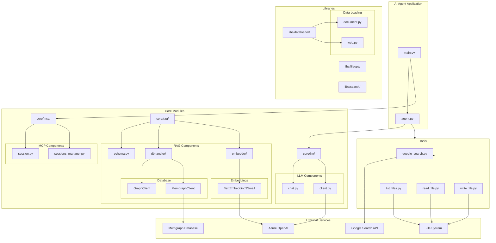

# AI Agent Architecture

This document describes the architecture and workflow of the AI Agent application, specifically focusing on the chat-with-tools-and-mcp functionality.

## Sequence Diagram


    Agent-->>User: Return Response to User
```

## Components

1. **User**: Initiates interaction by sending queries to the AI Agent.

2. **AI Agent**: The main application that orchestrates the entire workflow:
   - Initializes the Azure OpenAI client
   - Discovers and initializes available tools (both local and MCP-based)
   - Processes user queries
   - Routes tool calls to appropriate services
   - Returns final responses to the user

3. **Azure OpenAI Service (GPT-4.1)**: Provides the language model capabilities:
   - Processes natural language queries
   - Determines when and which tools to call
   - Generates final responses based on user queries and tool results

4. **Local Tools**: Built-in tools available to the agent:
   - google_search: Searches the web for information
   - list_files: Lists files in a directory
   - read_file: Reads content from files
   - write_file: Writes content to files

5. **MCP Server**: Model Context Protocol server that provides additional tools:
   - get_ice_cream_recommendation: Provides ice cream flavor recommendations
   - Additional tools that may be available depending on server configuration

6. **External Services**: Third-party services called by tools:
   - Search engines (for google_search)
   - File systems (for file operations)
   - Databases (for MCP tools)
   - Other APIs as needed

## Workflow Description

1. **Initialization Phase**:
   - The AI Agent initializes connections to Azure OpenAI Service
   - Local tools are registered and prepared for use
   - The MCP Server connection is established
   - Available MCP tools are discovered and registered with the Agent

2. **Query Processing**:
   - The user sends a natural language query to the AI Agent
   - The Agent passes this query to the Azure OpenAI model (GPT-4.1)
   - The model analyzes the query to determine the appropriate response strategy

3. **Tool Selection and Execution**:
   - If the model determines tools are needed, it requests specific tool calls
   - The Agent evaluates whether the requested tool is local or MCP-based:
     - For local tools: The Agent executes the tool directly, which may interact with external services
     - For MCP tools: The Agent forwards the request to the MCP Server, which handles execution
   - Tool execution results are collected and formatted by the Agent

4. **Response Generation**:
   - Tool results are sent back to the Azure OpenAI model
   - The model integrates these results with its knowledge to generate a comprehensive response
   - The Agent formats and returns the final response to the user

This workflow enables the AI Agent to leverage both built-in capabilities and external tools to provide rich, contextual responses to user queries while maintaining a clean separation of concerns between components.

## Component Architecture



## Component Details

### Core Application Files
- **`agent.py`**: Main AI agent entry point with conversation handling and tool orchestration
- **`main.py`**: Application startup script that initializes MCP sessions and starts the agent

### Core Modules

#### LLM (Language Model) - `core/llm/`
- **`chat.py`**: Handles chat interactions, tool calling, and message processing
- **`client.py`**: Azure OpenAI client wrapper for API communication

#### MCP (Model Context Protocol) - `core/mcp/`
- **`session.py`**: Individual MCP server session management
- **`sessions_manager.py`**: Orchestrates multiple MCP server connections and tool discovery

#### RAG (Retrieval-Augmented Generation) - `core/rag/`
- **`schema.py`**: Data models for graph database entities (Document, Chunk, Source, etc.)
- **`dbhandler/`**: Database interface implementations
  - **`__init__.py`**: Base GraphClient interface and implementation
  - **`memgraph.py`**: Memgraph-specific client implementation
- **`embedder/`**: Vector embedding services
  - **`text_embedding_3_small.py`**: Azure OpenAI embedding service implementation

### Libraries - `libs/`

#### Data Loading - `dataloader/`
- **`document.py`**: File-based document loader with chunking capabilities
- **`web.py`**: Web content loader with crawling support

#### File Operations - `fileops/`
- **`file.py`**: Core file operation utilities

#### Search - `search/`
- **`client.py`**: Search client interface
- **`service.py`**: Search service implementation

### Tools - `tools/`
Built-in tools available to the AI agent:
- **`google_search.py`**: Web search functionality using Google Search API
- **`list_files.py`**: Directory listing operations
- **`read_file.py`**: File content reading operations
- **`write_file.py`**: File content writing operations