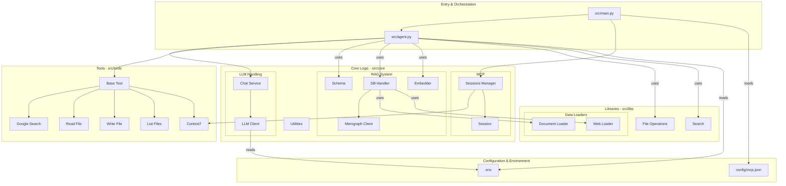
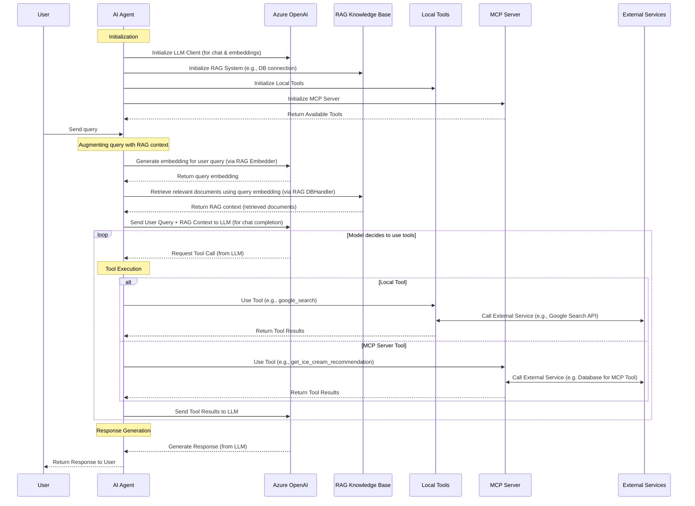
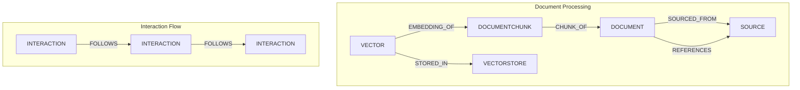

# AI Agent Software Architecture

This document provides an overview of the AI Agent's software architecture, detailing its main components and how they interact. The primary goal is to create a modular, extensible, and maintainable system.

## Core Components

The system is divided into several key packages and modules, primarily located within the `src` directory.

## Sequence Diagram

### 1. Entry & Orchestration (`src/`)
*   **`main.py`**: The main entry point of the application. Initializes core services, including the `MCPSessionManager` for discovering and integrating MCP-compatible tools, and starts the main agent loop.
*   **`agent.py`**: Contains the primary agent logic. It manages the conversation flow, interacts with the `Chat` service for LLM communication, and utilizes available `Tools` to perform actions or gather information.

### 2. Core Logic (`src/core/`)
This package houses the fundamental building blocks of the agent.

*   **LLM Handling (`src/core/llm/`)**
    *   `client.py`: Provides a low-level client for interacting with Large Language Models (e.g., OpenAI API). Handles API requests, responses, and error management.
    *   `chat.py`: Offers a higher-level `Chat` service that abstracts conversation management, message history, and tool integration with the LLM.

*   **RAG System (`src/core/rag/`)**: Enables Retrieval Augmented Generation.
    *   `schema.py`: Defines the nodes (e.g., `Document`, `DocumentChunk`) and edges (relationships) for the knowledge graph. Detailed node and edge types are described in the "RAG Graph Schema Details" section below.
    *   `dbhandler/__init__.py`: Defines the `GraphClient` interface for interacting with graph databases.
    *   `dbhandler/memgraph.py`: Implements `MemGraphClient` for storing and querying graph data in Memgraph.
    *   `embedder/__init__.py`: Defines the `EmbeddingService` interface for generating text embeddings.
    *   `embedder/text_embedding_3_small.py`: Implements embedding generation using a specific model (e.g., OpenAI's).
    *   For more details, see [RAG Architecture](./rag_architecture.md).

*   **MCP (Model Context Protocol) (`src/core/mcp/`)**
    *   `session.py`: Manages an individual session with an MCP-compatible tool/server.
    *   `sessions_manager.py`: Discovers, registers, and manages multiple MCP sessions, making external tools available to the agent.

*   **Utilities (`src/core/utils.py`, etc.)**: Common utility functions, decorators (e.g., `graceful_exit`, `mainloop`), and helper classes used across the application.

### 3. Libraries (`src/libs/`)
Reusable libraries providing specific functionalities.

*   **Data Loaders (`src/libs/dataloader/`)**: Modules for loading and processing data from various sources.
    *   `document.py`: Handles loading from local document files.
    *   `web.py`: Handles fetching content from web URLs.
*   **File Operations (`src/libs/fileops/file.py`)**: Utilities for file system interactions (reading, writing, listing files).
*   **Search (`src/libs/search/`)**: Components for integrating with external search services (e.g., Google Search API client and service).

### 4. Tools (`src/tools/`)
Defines the tools available to the AI agent. Each tool typically inherits from a base `Tool` class (found in `src/tools/__init__.py`) and implements specific actions.

*   `google_search.py`: Tool for performing Google searches.
*   `read_file.py`: Tool for reading file contents.
*   `write_file.py`: Tool for writing content to files.
*   `list_files.py`: Tool for listing files in a directory.
*   `context7.py`: Tool for interacting with the Context7 API (e.g., for fetching coding best practices).
*   Other tools can be added here to extend the agent's capabilities.

### 5. Configuration & Environment
*   `.env`: Stores environment variables, including API keys and other secrets. This file is not committed to the repository.
*   `config/mcp.json`: Configuration file for the `MCPSessionManager`, specifying details for connecting to MCP servers/tools.

## Design Principles

*   **Modularity:** Components are designed to be independent and interchangeable where possible.
*   **Extensibility:** New tools, LLM providers, data sources, and libraries can be added with minimal changes to the core system.
*   **Separation of Concerns:** Different functionalities (e.g., LLM interaction, RAG, tool usage) are handled by distinct modules.
*   **Abstraction:** Interfaces (e.g., `GraphClient`, `EmbeddingService`, `Tool`) allow for different implementations.

## RAG Graph Schema Details

This section outlines the types of nodes and the relationships (edges) between them within the Retrieval Augmented Generation (RAG) knowledge graph. The schema is primarily defined in `src/core/rag/schema.py`.

### Node Types

The core entities in our graph are:

*   **`DOCUMENT`**: Represents a full document, such as a file or a web page, containing content and metadata.
*   **`DOCUMENTCHUNK`**: Represents a segment of a `DOCUMENT`. These chunks are what get embedded and used for similarity searches. Content is stored in both the graph and the vector store.
*   **`INTERACTION`**: Represents a chat message (user or assistant) or a system-level interaction/event.
*   **`SOURCE`**: Represents the origin of a `DOCUMENT`, like a website URL, a file path, or an API endpoint.
*   **`VECTORSTORE`**: Represents an embedding storage system where vector embeddings are kept.
*   **`VECTOR`**: Represents the actual embedding vector for a `DOCUMENTCHUNK`.

### Edge Types (Relationships)

Relationships define how these nodes are connected:

*   **`CHUNK_OF`**: `DOCUMENTCHUNK` → `DOCUMENT`
    *   Indicates that a `DOCUMENTCHUNK` is a part of a larger `DOCUMENT`.
*   **`FOLLOWS`**: `INTERACTION` → `INTERACTION`
    *   Links `INTERACTION` nodes chronologically to maintain conversation history.
*   **`SOURCED_FROM`**: `DOCUMENT` → `SOURCE`
    *   Connects a `DOCUMENT` to its original `SOURCE`.
*   **`STORED_IN`**: `VECTOR` → `VECTORSTORE`
    *   Shows that a `VECTOR` embedding is managed by a specific `VECTORSTORE`.
*   **`EMBEDDING_OF`**: `VECTOR` → `DOCUMENTCHUNK`
    *   Links a `VECTOR` embedding to the `DOCUMENTCHUNK` it represents.
*   **`REFERENCES`**: `DOCUMENT` → `SOURCE`
    *   Indicates that a `DOCUMENT` makes reference to a `SOURCE` (e.g., a citation or link within the document content).

### RAG Schema Diagram

This schema allows for flexible querying of document origins, their content (via chunks and embeddings), and the history of interactions related to them.

This architecture provides a solid foundation for developing a sophisticated and adaptable AI agent.