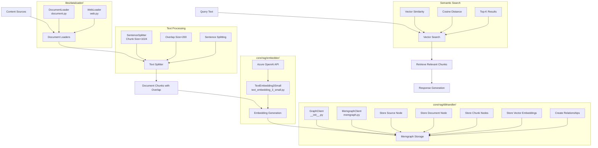

# RAG Architecture

This document outlines the architecture of our Retrieval-Augmented Generation (RAG) system using a graph database (Memgraph) for storing documents, chunks, and their relationships, with vector embeddings for semantic search.

## Core Components Overview

The RAG system consists of these main components:

1. **Loaders**: Specialized classes for loading different content types (in `libs/dataloader/`)
   - `DocumentLoader`: Processes files from local filesystem (`document.py`)
   - `WebLoader`: Extracts content from web pages with crawling capability (`web.py`)

2. **Text Processing**: Content chunking and preparation for embedding
   - Uses `SentenceSplitter` from llama-index for semantically meaningful chunks
   - Configurable chunk size and overlap parameters

3. **Embedding Generation**: Creates vector representations (in `core/rag/embedder/`)
   - `TextEmbedding3Small`: Azure OpenAI embeddings service
   - Batch processing with concurrency control

4. **Graph Database**: Stores documents, chunks, and relationships (in `core/rag/dbhandler/`)
   - `MemgraphClient`: Interface to Memgraph database (implemented in `__init__.py`)
   - Entity relationships (CHUNK_OF, SOURCED_FROM, etc.)
   - Vector indexing for similarity search

## Architecture Diagram



## Implementation Details

### Data Schema

The RAG system uses the following node types:

1. **Source**: Represents the origin of documents
   - Properties: name, type, uri
   - Types: "file", "website", etc.

2. **Document**: Represents a full document with content and metadata
   - Properties: path, content, title, source_id, reference_ids
   - Linked to Source with SOURCED_FROM relationship

3. **DocumentChunk**: Represents a portion of a document for embedding
   - Properties: path, content, content_hash, parent_id, chunk_index
   - Linked to Document with CHUNK_OF relationship

4. **VectorStore**: Represents embedding storage configuration
   - Properties: model, status, index_name, dimension, etc.

5. **Vector**: Represents embedding vectors for document chunks
   - Properties: chunk_id, vector_store_id, embedding
   - Linked to DocumentChunk with EMBEDDING_OF relationship
   - Linked to VectorStore with STORED_IN relationship

6. **Interaction**: Represents a chat message or system interaction
   - Properties: session_id, content, role
   - Linked chronologically with FOLLOWS relationship

### Document Processing Flow

The document processing pipeline follows these steps:

1. **Loading**: Content is loaded using appropriate loaders
   ```python
   # Example: Loading from web
   loader = WebLoader("https://example.com/page")
   for source, doc, chunks in loader.load_data():
       # Process source, document, and chunks
   ```

2. **Chunking**: Documents are split into optimal chunks
   ```python
   # Using sentence splitter with customizable parameters
   splitter = SentenceSplitter(chunk_size=1024, chunk_overlap=200)
   nodes = splitter.get_nodes_from_documents([document])
   ```

3. **Embedding**: Chunk text is converted to vector embeddings
   ```python
   # Process chunks and generate embeddings
   await embedder.process_chunks(chunks, callback=lambda v: vectors.append(v))
   ```

4. **Storage**: All entities are stored in the graph database
   ```python
   # Store entities with relationships
   db.create_source(source)
   db.create_document(doc)
   db.create_chunk(chunk)
   db.create_vector(vector)
   ```

### Retrieval Process

The retrieval process involves:

1. **Query Embedding**: Convert user query to a vector
   ```python
   query_embedding = await embedder.get_embedding(query_text)
   ```

2. **Vector Search**: Find similar vectors in the database
   ```python
   results = db.search_chunks(query_embedding, k=5)
   ```

3. **Processing Results**: Extract and process matching chunks
   ```python
   for result in results:
       chunk = result["chunk"]
       similarity = result["similarity"]
       # Process chunk content
   ```

## Environment Configuration

The RAG system requires these environment variables:

- `AZURE_OPENAI_API_KEY`: For embedding generation
- `MEMGRAPH_URI`: Memgraph database connection URI (default: localhost)
- `MEMGRAPH_PORT`: Database port (default: 7687)
- `MEMGRAPH_USERNAME`: Database username (default: memgraph)
- `MEMGRAPH_PASSWORD`: Database password (default: memgraph)

## Usage Example

```python
from dotenv import load_dotenv
load_dotenv(override=True)

from core.azureopenai.client import Client
from core.rag.embedder import TextEmbedding3Small
from core.rag.graph_client import MemGraphClient
from core.rag.loader.web_loader import WebLoader

# Set up clients
api_key = os.environ.get("AZURE_OPENAI_API_KEY")
db = MemGraphClient(host=os.environ.get("MEMGRAPH_URI", "localhost"))
loader = WebLoader("https://example.com/page")
embedder = TextEmbedding3Small()

# Create vector store
vector_store = db.create_vector_store(**embedder.get_metadata())

# Process documents
for source, doc, chunks in loader.load_data():
    vectors = []
    await embedder.process_chunks(chunks, callback=lambda v: vectors.append(v))
    
    # Store everything
    db.create_source(source)
    db.create_document(doc)
    for chunk in chunks:
        db.create_chunk(chunk)
    for vector in vectors:
        vector.vector_store_id = vector_store.id
        db.create_vector(vector)
```