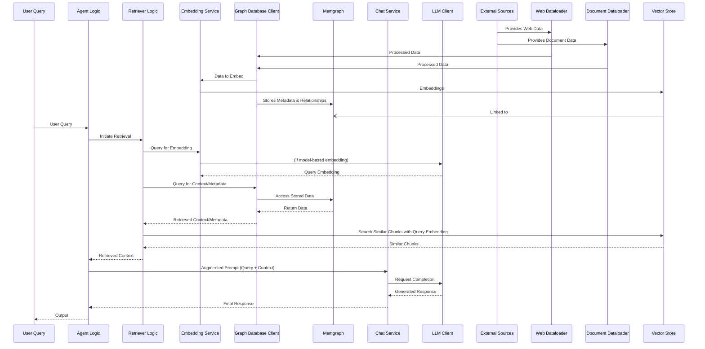

# RAG System Architecture

This document describes the architecture of the Retrieval Augmented Generation (RAG) system, which enhances the AI agent's responses by incorporating information from a dynamic knowledge base.

## Core Components

The RAG system is built around several key components that work together to ingest, store, retrieve, and utilize knowledge.

### 1. Data Loaders (`src/libs/dataloader/`)
*   **Purpose:** Fetch and preprocess data from various sources.
*   **Components:**
    *   `web.py`: Loads content from web URLs.
    *   `document.py`: Loads content from local files (e.g., PDF, TXT).
    *   `__init__.py`: Provides a common interface or factory for data loaders.
*   **Process:** Raw data is read, cleaned, and potentially split into initial document representations.

### 2. Embedding Service (`src/core/rag/embedder/`)
*   **Purpose:** Convert text chunks into vector embeddings.
*   **Components:**
    *   `text_embedding_3_small.py`: Implements embedding generation using OpenAI's `text-embedding-3-small` model.
    *   `__init__.py`: Defines the `EmbeddingService` interface.
*   **Process:** Takes text as input and outputs dense vector representations suitable for similarity search.

### 3. Graph Database Handler (`src/core/rag/dbhandler/`)
*   **Purpose:** Manage the storage and retrieval of nodes (documents, chunks, sources, etc.) and their relationships in a graph database.
*   **Components:**
    *   `memgraph.py`: Implements the `MemGraphClient` for interacting with a Memgraph instance. This client handles storing document metadata, chunk information, and the relationships defined in the schema. It also conceptually manages or links to the vector embeddings.
    *   `__init__.py`: Defines the generic `GraphClient` interface.
*   **Process:** Stores structured data and relationships. While Memgraph can store vectors, the primary vector search might occur via a specialized vector store or index, with Memgraph holding pointers or metadata.

### 4. Graph Schema (`src/core/rag/schema.py`)
*   **Purpose:** Defines the types of nodes (e.g., `Document`, `DocumentChunk`, `Source`) and edges (e.g., `CHUNK_OF`, `SOURCED_FROM`) in the knowledge graph.
*   **Process:** Provides the structural blueprint for the data stored in Memgraph.

### 5. Retriever (Conceptual)
*   **Purpose:** Orchestrates the retrieval process. Given a user query, it:
    1.  Generates an embedding for the query (using the `EmbeddingService`).
    2.  Searches a vector store for the most similar document chunks.
    3.  Queries the `GraphDB` (Memgraph) to fetch additional context, metadata, or related information for the retrieved chunks.
    4.  Compiles the retrieved information into a context to be passed to the LLM.
*   **Note:** Currently, retriever logic is integrated within other components (e.g., the main agent logic or specific tool implementations) rather than a dedicated `src/core/rag/retriever.py` file. This may be centralized in the future.

### 6. Vector Store (Conceptual)
*   **Purpose:** Efficiently store and search high-dimensional vector embeddings.
*   **Implementation:** While not a separate module, vector storage and search capabilities are implicitly part of the RAG system, often managed by or alongside the `GraphDB` (e.g., Memgraph's own vector indexing or an external vector database linked via IDs in the graph).

## Data and Control Flow

### Data Ingestion

1.  **Load Data:** `DataLoaders` fetch content from `ExternalSources`.
2.  **Create Documents/Chunks:** Data is processed into `Document` and `DocumentChunk` nodes as per `GraphSchema`.
3.  **Store Metadata:** The `GraphDB` client (`MemGraphClient`) saves these nodes and their relationships in Memgraph.
4.  **Generate Embeddings:** `DocumentChunk` content is sent to the `EmbeddingService` to create vectors.
5.  **Store Embeddings:** Embeddings are stored in the `VectorStore` (conceptually, this could be within Memgraph or an external system linked by the graph).

### Retrieval and Augmentation

1.  **User Query:** The `Agent` receives a `User Query`.
2.  **Retrieve Context:** The `Retriever` logic is invoked.
    *   Query is embedded via `EmbeddingService`.
    *   Relevant chunks are fetched from `VectorStore` via similarity search.
    *   Additional context is fetched from `GraphDB` (Memgraph).
3.  **Augment Prompt:** The retrieved context is combined with the original query to form an augmented prompt.
4.  **Generate Response:** The augmented prompt is sent to the `LLM` (via `src/core/llm/chat.py` and `src/core/llm/client.py`).
5.  **Return Response:** The LLM generates a response, which is returned to the user via the `Agent`.

This architecture allows the agent to leverage a rich, interconnected knowledge base, leading to more informed and contextually relevant interactions.