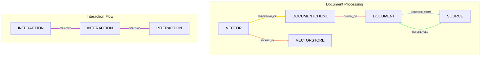

# RAG Graph Edge Relationships

This document outlines the types of nodes and the relationships (edges) between them within the Retrieval Augmented Generation (RAG) knowledge graph. The schema is primarily defined in `src/core/rag/schema.py`.

## Node Types

The core entities in our graph are:

*   **`DOCUMENT`**: Represents a full document, such as a file or a web page, containing content and metadata.
*   **`DOCUMENTCHUNK`**: Represents a segment of a `DOCUMENT`. These chunks are what get embedded and used for similarity searches. Content is stored in both the graph and the vector store.
*   **`INTERACTION`**: Represents a chat message (user or assistant) or a system-level interaction/event.
*   **`SOURCE`**: Represents the origin of a `DOCUMENT`, like a website URL, a file path, or an API endpoint.
*   **`VECTORSTORE`**: Represents an embedding storage system where vector embeddings are kept.
*   **`VECTOR`**: Represents the actual embedding vector for a `DOCUMENTCHUNK`.

## Edge Types (Relationships)

Relationships define how these nodes are connected:

*   **`CHUNK_OF`**: `DOCUMENTCHUNK` → `DOCUMENT`
    *   Indicates that a `DOCUMENTCHUNK` is a part of a larger `DOCUMENT`.
*   **`FOLLOWS`**: `INTERACTION` → `INTERACTION`
    *   Links `INTERACTION` nodes chronologically to maintain conversation history.
*   **`SOURCED_FROM`**: `DOCUMENT` → `SOURCE`
    *   Connects a `DOCUMENT` to its original `SOURCE`.
*   **`STORED_IN`**: `VECTOR` → `VECTORSTORE`
    *   Shows that a `VECTOR` embedding is managed by a specific `VECTORSTORE`.
*   **`EMBEDDING_OF`**: `VECTOR` → `DOCUMENTCHUNK`
    *   Links a `VECTOR` embedding to the `DOCUMENTCHUNK` it represents.
*   **`REFERENCES`**: `DOCUMENT` → `SOURCE`
    *   Indicates that a `DOCUMENT` makes reference to a `SOURCE` (e.g., a citation or link within the document content).

## Mermaid Diagram

This schema allows for flexible querying of document origins, their content (via chunks and embeddings), and the history of interactions related to them.